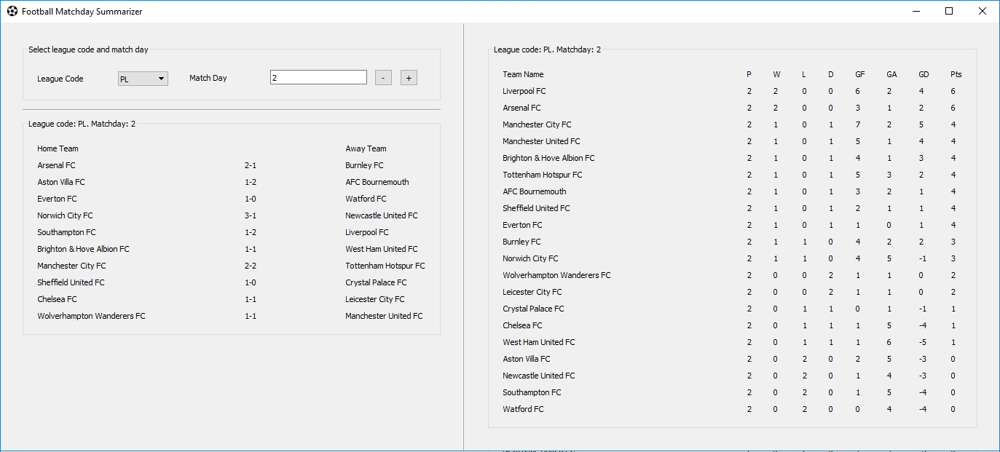

# Football Matchday Summarizer
A desktop application to allow you to check all the pertinent information from the top 4 European football leagues (Premier League, La Liga, Bundesliga and Serie A) rapidly.

## How, Why, API
Wanting to be able to check all the pertinent information across the top 4 european leagues rapidly. As things stand, to check the tables, the results and the goalscorers of each game (as well as see the times of the games in the matchweek yet to be played) can require dozens of mouseclicks. Here, simply by choosing the league and selecting your gameweek, you will find all this information on one clean screen.

I was also motivated by my curiosity abut working with APIs and learning to create front-ends in py. I collaborated with user [PyJay](https://github.com/PyJay) to build a GUI in enaml/QTPy to create this handy tool.

The API in use here is free - [football-data API](https://www.football-data.org/)
The free license to this API only allows 10 calls a minute. Each of the below, per league count as one call:
-	Standings
-	Matches
-	Goalscorers in each game

So clicking on "PL" costs 2 calls as it loads the matches and then the scorers underneath it. Including the standings being refreshed upon a new league being selected, it will cost in total 3 calls.

## Installation
To install on an environment you can simply execute the following
`pip install git+https://github.com/Hridai/Football_Matchday_Summarizer`
Once installed you can run the app using the run-app.exe script in the environment
If this doesn't work, run the below command in the root directory
'python setup.py develop'

## Support or Contact
Run into any bugs or have further questions? Drop me an e-mail HridaiTrivedy@gmail.com

### To Add
- Add more leagues (Ligue 1? Trivial addition)
- Add scorers. mins of goals
- Add times for games in matchweek not yet played. Timezone adjustments?
- Add a screenshot of the GUI in this readme
- Add position number to the standings table
- Put all of the results in a scrollable list, as it will easily exceed the height of the screen if many scorers, standings incl
- Change the heading of the league table
